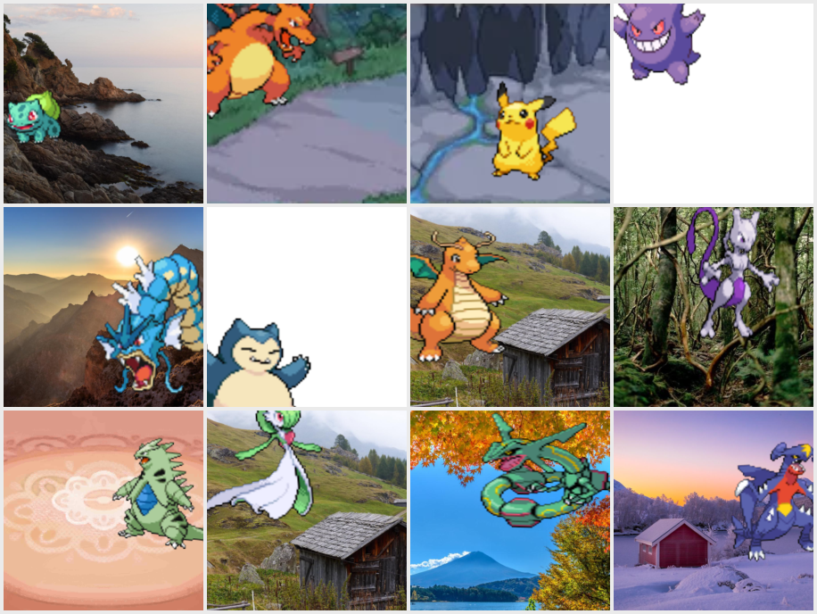
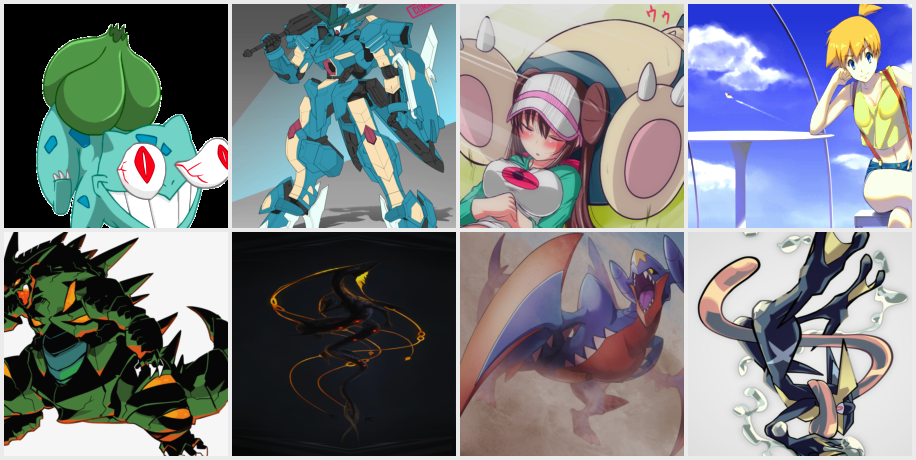
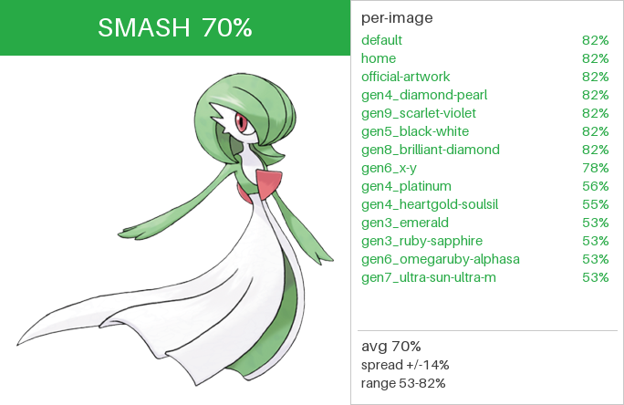
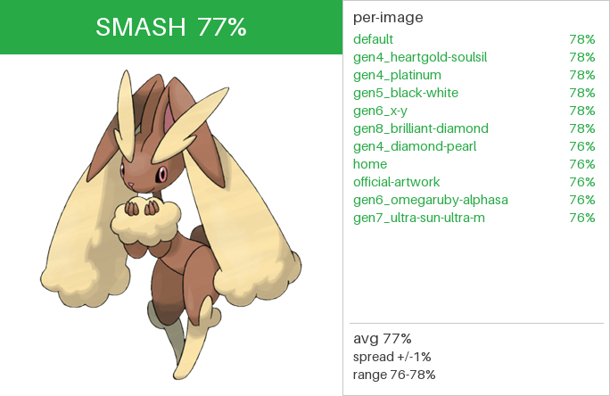
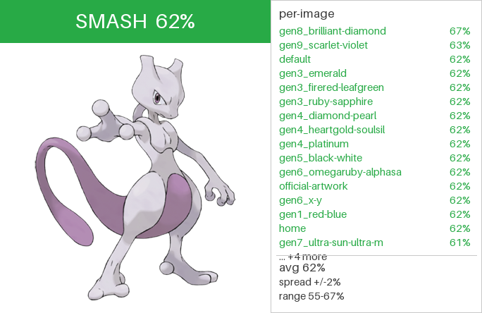
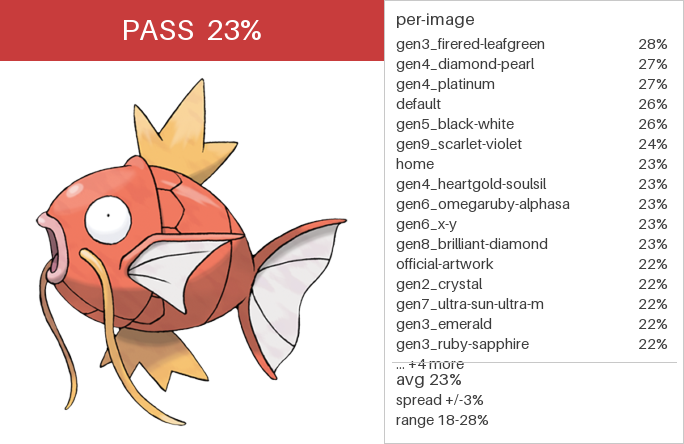
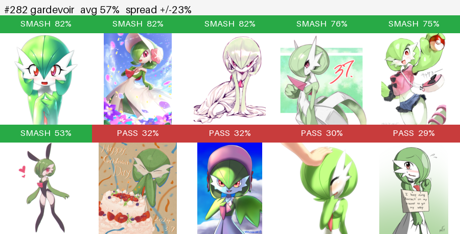
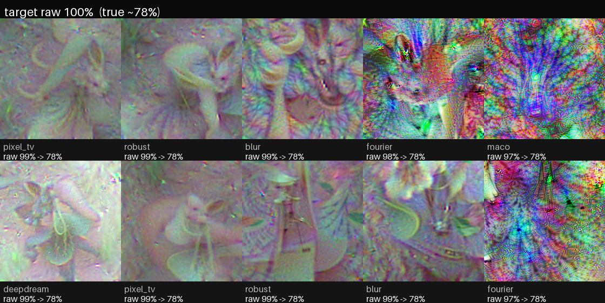
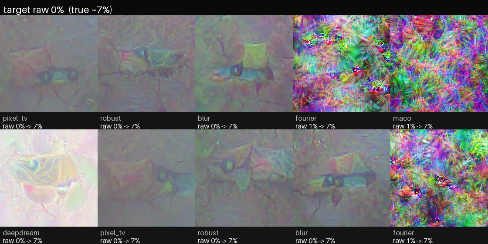
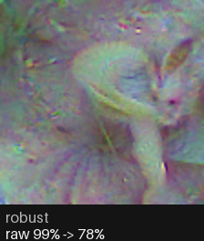

# `vit_small_mixed_v1` -- reference model

The proven reference checkpoint for Smash or Transformer. Everything below is
what this checkpoint actually used, sufficient to recreate it from scratch.
See [../MODELS.md](../MODELS.md) for the model index and [../README.md](../README.md)
for the general workflow.

## At a glance

- **Task:** regress a single scalar -- the crowd "smash" fraction (0-1) -- from
  one image of a Pokemon.
- **Backbone:** `timm` ViT-Small/16 @ 224, ImageNet-pretrained, fine-tuned.
- **Trained on:** 21,076 images across all 1,025 Pokemon (official artwork,
  in-game sprites, and Safebooru fan-art), composited onto varied backgrounds.
- **Result:** validation Spearman **0.755**, Pearson 0.815, MAE 0.057.
- **Hardware/time:** single RTX 5070, ~82 s/epoch, ~38 min total (28 epochs).

## Architecture

`model/model.py` -- `SmashRanker`:

```
timm.create_model("vit_small_patch16_224", pretrained=True,
                  num_classes=0, img_size=224)        # -> 384-d CLS feature
head = Sequential(Dropout(0.1), Linear(384, 1))       # -> scalar logit
forward(x) = head(backbone(x)).squeeze(-1)            # logit; sigmoid -> [0,1]
```

- Input normalization uses the backbone's own `timm` mean/std (stored in the
  checkpoint as `data_config`).
- **Loss:** soft-label BCE (`model/loss.py`) -- BCE-with-logits against the
  continuous smash fraction as a soft target, not a hard 0/1 label.
- **Model input render:** stretch-to-square to 224 (aspect not preserved); the
  augmentation pipeline produces the 224x224 canvas directly at train time.

## Data gathering

Three independent sources, each its own CLI (all idempotent):

1. **Labels -- crowd votes.** `scrape_pokesmash.py` pulls per-Pokemon
   smash/pass aggregate counts from pokesmash.xyz's public Firebase RTDB into
   `pokesmash_votes.csv`. The training target is `smash / (smash + pass)`; vote
   volume is recorded but not used for weighting (the difference between ~200k
   and ~2M votes is statistically negligible for the fraction).

   ```bash
   uv run python scrape_pokesmash.py
   ```

2. **Official + in-game images.** `download_images.py` fetches from PokeAPI
   into `images/{id}/`, writing a per-folder `meta.csv`. Per Pokemon this
   yields the **portrait** category (`official-artwork`, `home`, `default`) and
   the **in-game** category (per-generation sprites: `gen3_emerald`,
   `gen4_platinum`, `gen5_black-white`, ... `gen9_scarlet-violet`).

   ```bash
   uv run python download_images.py
   ```

3. **Booru fan-art.** `data_prep.booru` pulls the top-scored Safebooru art per
   Pokemon into `images/{id}/booru/`, filtering out human-only art (`1girl`,
   `1boy`, ...) and group pics (other Pokemon tags). `mixed_v1` used the top
   **10** per Pokemon.

   ```bash
   uv run python -m data_prep.booru --top 10
   ```

**Backgrounds** (for compositing transparent sprites) live in
`backgrounds/real/` (real photos) and `backgrounds/pokemon_battle/` (battle
backdrops sliced from sprite sheets via `slice_battle_bgs.py`).

## Dataset preparation

Built with `data_prep.prepare` from a JSON config into `datasets/mixed_v1/`
(packed `images.bin` blob + `data.npz` metadata + `split.json`).

- **Selection:** categories `portrait`, `in-game`, `booru`; `minimages = 3`
  (below this, augmentation relaxation ensures every Pokemon still contributes).
- **Split:** Pokemon-level, `val_frac = 0.1` -> **923 train / 102 val** Pokemon.
- **Sampling:** `fill_so` with no explicit target -> every Pokemon gets the
  same number of augmented samples per epoch (the dataset's max image count),
  cycling each Pokemon's images equally. **27,690 samples/epoch.**

**Composition (21,076 images, 1,025 Pokemon):**

| Category | Images | Notes |
|----------|-------:|-------|
| in-game  | 8,982  | per-generation sprites |
| booru    | 10,044 | top-10 Safebooru fan-art |
| portrait | 2,050  | official-artwork + home (2/Pokemon) |

```bash
uv run python -m data_prep.prepare configs/example_mixed.json   # name: mixed_v1
```

## Augmentation (as trained)

Two source-aware pipelines (`data_prep/augmentations.py`), routed by category
(`booru` -> photo, everything else -> sprite):

**Sprite** (official / in-game; RGBA with transparency):

| Step | Setting |
|------|---------|
| Scale (w, h independent) | 0.65-1.10 x canvas, bilinear |
| Rotate | -10 deg to +10 deg |
| Position (center) | x, y in 0.10-0.90 of canvas |
| Horizontal flip | p = 0.5 |
| Composite background | real bg with p = 0.8, else white (`backgrounds/real` + `backgrounds/pokemon_battle`) |

**Photo** (booru; opaque):

| Step | Setting |
|------|---------|
| Random resized crop | scale 0.6-1.0 |
| Color jitter | brightness 0.2, contrast 0.2, saturation 0.2, hue 0.05 |
| Horizontal flip | p = 0.5 |

> Note: the booru/photo pipeline has since been revised (place-on-canvas with
> white/black/random background + scale 0.9-1.2 + heavier color); that version
> is used by `mixed_v2`, **not** by this reference model.

### Training samples

What the model actually sees each epoch. Sprites (official / in-game) are
scaled, rotated, positioned, flipped, and composited onto a real background
(p = 0.8, else white):



Booru fan-art is random-resized-cropped and color-jittered (the crop fills the
frame, so no padding). Booru is noisier and occasionally includes stylized or
humanized fan-art -- rare fall-throughs of the human/group tag filter:



## Training

`model/train.py`, config `configs/train_mixed.json`:

| Hyperparameter | Value |
|----------------|-------|
| epochs | 30 (best at 24; early stop kept best) |
| batch size | 64 |
| optimizer | AdamW, weight decay 0.05 |
| LR (head / backbone) | 1e-3 / 2e-5 |
| schedule | 1-epoch linear warmup, then cosine |
| freeze schedule | backbone frozen for 3 epochs (head warmup), then unfrozen |
| dropout | 0.1 |
| precision | bf16 autocast (AMP) |
| grad clip | 1.0 |
| seed | 0 |

```bash
uv run python -m model.train configs/train_mixed.json
```

Each run writes `runs/vit_small_mixed_v1/`: `checkpoints/{best,last,epoch_NNN}.pt`,
`history.{csv,jsonl}`, per-epoch `predictions/`, and a `config.json` snapshot of
both the train and dataset configs (the source of truth for this guide).

## Calibration

The raw sigmoid is monotonic but not on the true smash-fraction scale.
`model/calibrate.py` fits isotonic regression and writes `calibration.json`
next to the checkpoint (`train` / `val` / `combined` maps). The fitted `val`
map is compressive at the extremes -- a raw **99%** maps to ~**77.5%**
calibrated, raw **~0%** to ~**6.8%** -- reflecting that no real Pokemon is
universally smashed or passed.

```bash
uv run python -m model.calibrate --checkpoint runs/vit_small_mixed_v1/checkpoints/best.pt
```

## Results

Selection metric (per-Pokemon, held-out val): **Spearman 0.755 / Pearson 0.815
/ MAE 0.057**. Averaging a Pokemon's score across all its images ("all-avg")
beats any single source -- adding in-game + booru lifts val Spearman from the
portraits-only baseline's 0.728.

Sample predictions (calibrated %, mixed model; `portrait` = official art only,
`all-avg` = mean over every image):

| # | Pokemon | true | portrait | all-avg | split |
|--:|---------|----:|----:|----:|:---:|
| 282 | Gardevoir | 82.1 | 82.1 | 69.7 | val |
| 428 | Lopunny | 77.5 | 75.9 | 76.8 | train |
| 448 | Lucario | 69.3 | 68.3 | 70.3 | train |
| 150 | Mewtwo | 62.5 | 62.4 | 61.6 | train |
| 131 | Lapras | 47.2 | 47.2 | 47.1 | train |
| 6 | Charizard | 39.8 | 31.5 | 31.4 | val |
| 143 | Snorlax | 35.8 | 38.7 | 36.4 | train |
| 129 | Magikarp | 23.1 | 22.3 | 23.1 | train |
| 98 | Krabby | 8.4 | 8.2 | 8.9 | train |

### Sample scorecards

Each card (from `model.results`) shows the portrait, the per-image scores by
source, and the averaged verdict with spread/range.







Booru fan-art is scored individually too (`model.score_booru`):



### What the model finds attractive ("dreaming")

Activation maximization (`model.acti_maxim`) optimizes an image to hit a target
score bracket. At the top bracket the model conjures soft, rounded creature
forms with face/eye clusters; at the bottom, muddy chaotic textures.

Maximally smashable (target 1.0) vs minimally (target 0.0):




The single most legible "ideal" (robust technique, raw 99% -> 78% calibrated):



## Reproduce from scratch

```bash
uv sync
uv run python scrape_pokesmash.py                       # labels
uv run python download_images.py                        # official + in-game
uv run python -m data_prep.booru --top 10               # booru fan-art
uv run python -m data_prep.prepare configs/example_mixed.json   # -> datasets/mixed_v1
uv run python -m model.train configs/train_mixed.json   # -> runs/vit_small_mixed_v1
uv run python -m model.calibrate --checkpoint runs/vit_small_mixed_v1/checkpoints/best.pt
uv run python -m model.results --checkpoint runs/vit_small_mixed_v1/checkpoints/best.pt
```
