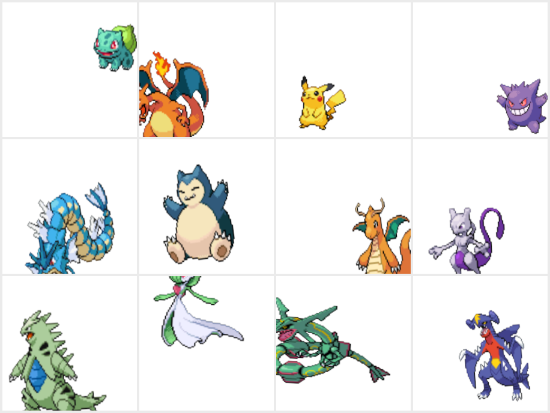

# `vit_small_portraits_v1` -- baseline model

The first Smash or Transformer model: official artwork + in-game sprites only,
no fan-art, composited on plain white. It established the baseline that the
mixed model ([vit_small_mixed_v1](vit_small_mixed_v1.md)) later beat by adding
booru fan-art and real backgrounds. See [../MODELS.md](../MODELS.md) for the
model index and [../README.md](../README.md) for the general workflow.

> **Git state:** trained at commit `1ff5c0c` ("Skip unreadable images during
> build and add tqdm progress bars"). The repo was simpler then -- a single
> white-background augmentation pipeline, legacy in-`npz` image storage, no
> booru scraping, and no calibrate/results/dreaming tooling yet (all added
> later). Everything below reflects that state.

## At a glance

- **Task:** regress the crowd "smash" fraction (0-1) from one image of a Pokemon.
- **Backbone:** `timm` ViT-Small/16 @ 224, ImageNet-pretrained, fine-tuned.
- **Trained on:** 11,032 images across all 1,025 Pokemon (official artwork +
  in-game sprites only), each placed on a plain white canvas.
- **Result:** validation Spearman **0.728**, Pearson 0.787, MAE 0.058.
- **Hardware/time:** single RTX 5070, ~17 s/epoch, ~8.7 min total (30 epochs).

## Architecture

`model/model.py` -- `SmashRanker` (identical to later models):

```
timm.create_model("vit_small_patch16_224", pretrained=True,
                  num_classes=0, img_size=224)        # -> 384-d CLS feature
head = Sequential(Dropout(0.1), Linear(384, 1))       # -> scalar logit
forward(x) = head(backbone(x)).squeeze(-1)            # logit; sigmoid -> [0,1]
```

- Input normalization uses the backbone's own `timm` mean/std (in the
  checkpoint as `data_config`).
- **Loss:** soft-label BCE (`model/loss.py`) against the continuous smash
  fraction.

## Data gathering

Two sources (no booru at this stage):

1. **Labels -- crowd votes.** `scrape_pokesmash.py` pulls per-Pokemon
   smash/pass aggregate counts from pokesmash.xyz's public Firebase RTDB into
   `pokesmash_votes.csv`. Target = `smash / (smash + pass)`.

   ```bash
   uv run python scrape_pokesmash.py
   ```

2. **Official + in-game images.** `download_images.py` fetches from PokeAPI
   into `images/{id}/` with a per-folder `meta.csv`: the **portrait** category
   (`official-artwork`, `home`) and the **in-game** category (per-generation
   sprites).

   ```bash
   uv run python download_images.py
   ```

## Dataset preparation

Built with `data_prep.prepare` from `configs/example.json` into
`datasets/portraits_v1/`. At this commit images were stored decoded directly in
`data.npz` (the legacy in-`npz` format, ~2.6 GB; the memory-bounded packed-blob
storage came later).

- **Selection:** categories `portrait`, `in-game`; `minimages = 3`.
- **Split:** Pokemon-level, `val_frac = 0.1` -> **923 train / 102 val** Pokemon.
- **Sampling:** `fill_so` with no explicit target -> every Pokemon gets the
  dataset's max image count of augmented samples per epoch, cycling its images.
  **18,460 samples/epoch.**

**Composition (11,032 images, 1,025 Pokemon):**

| Category | Images | Notes |
|----------|-------:|-------|
| in-game  | 8,982  | per-generation sprites |
| portrait | 2,050  | official-artwork + home (2/Pokemon) |

```bash
uv run python -m data_prep.prepare configs/example.json   # name: portraits_v1
```

## Augmentation (as trained)

A single pipeline for all images (the source-aware sprite/photo split did not
exist yet), `data_prep/augmentations.py` `build_augmentations`:

| Step | Setting |
|------|---------|
| Scale (w, h independent) | 0.65-1.10 x canvas, bilinear |
| Rotate | -10 deg to +10 deg |
| Position (center) | x, y in 0.10-0.90 of canvas |
| Composite background | **white only** |

> No horizontal flip and no real-background compositing at this stage -- both
> were introduced later and are part of `mixed_v1`'s sprite pipeline.

### Training samples

What the model sees each epoch: every image scaled, rotated, and positioned on
a plain white canvas (no backgrounds, no flip):



## Training

`model/train.py`, config `configs/train_example.json`:

| Hyperparameter | Value |
|----------------|-------|
| epochs | 30 (best at 18) |
| batch size | 64 |
| optimizer | AdamW, weight decay 0.05 |
| LR (head / backbone) | 1e-3 / 2e-5 |
| schedule | 1-epoch linear warmup, then cosine |
| freeze schedule | backbone frozen for 3 epochs (head warmup), then unfrozen |
| dropout | 0.1 |
| precision | bf16 autocast (AMP) |
| grad clip | 1.0 |
| seed | 0 |

```bash
uv run python -m model.train configs/train_example.json
```

Writes `runs/vit_small_portraits_v1/`: `checkpoints/{best,last,epoch_NNN}.pt`,
`history.{csv,jsonl}`, per-epoch `predictions/`, and a `config.json` snapshot of
both the train and dataset configs (the source of truth for this guide).

## Results

Selection metric (per-Pokemon, held-out val): **Spearman 0.728 / Pearson 0.787
/ MAE 0.058**, best at epoch 18.

This is the baseline. Adding in-game variety plus booru fan-art and real
backgrounds, and averaging across an entity's images, lifts validation Spearman
to 0.755 in [vit_small_mixed_v1](vit_small_mixed_v1.md).

> Calibration (`model/calibrate.py`) and the scorecard/results renderers were
> added to the repo after this commit. To calibrate or visualize this
> checkpoint, use the current CLIs:
> ```bash
> uv run python -m model.calibrate --checkpoint runs/vit_small_portraits_v1/checkpoints/best.pt
> uv run python -m model.results   --checkpoint runs/vit_small_portraits_v1/checkpoints/best.pt
> ```

## Reproduce from scratch

```bash
uv sync
uv run python scrape_pokesmash.py                       # labels
uv run python download_images.py                        # official + in-game
uv run python -m data_prep.prepare configs/example.json # -> datasets/portraits_v1
uv run python -m model.train configs/train_example.json # -> runs/vit_small_portraits_v1
```
